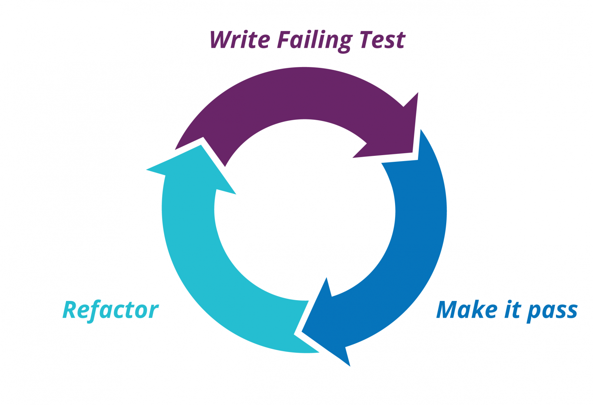

# Test Driven Development workshop

<!-- end_slide -->

## What's TDD?
Test Driven Development is a technique for building software that guides software development by writing tests.

<!-- end_slide -->

## Yes but... What does it mean?
Test Driven Development (TDD) is a software development process that force you to write a test that makes your code fails first then write the implementation to make it pass the test. In other words, your system behavior driven by written tests.

<!-- end_slide -->

## How do you do it?

1. Write a list of the test scenarios you want to cover - Acceptance Criteria
2. Turn exactly one item on the list into an actual, concrete, runnable test
3. Change the code to make the test (& all previous tests) pass
4. Optionally refactor to improve the implementation design
5. Until the list is empty, go back to #2

<!-- end_slide -->

<!-- end_slide -->

## Let's try!